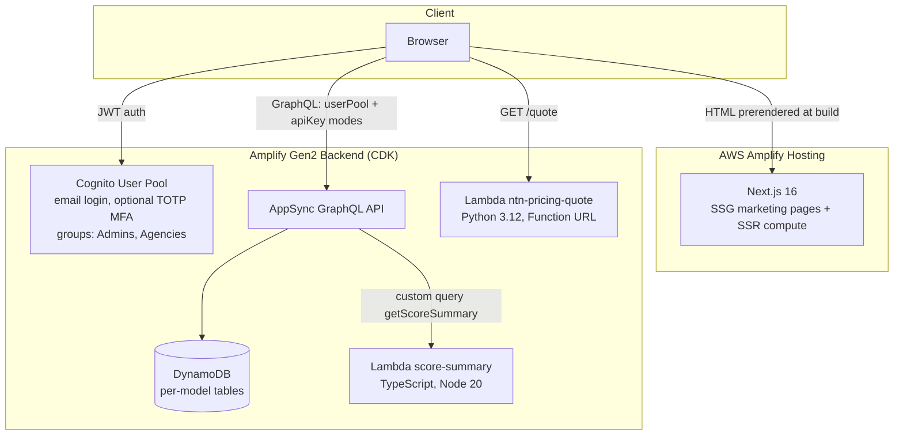

# Architecture

## System overview

## Request flows

**Public pages (`/`, `/jobs`, `/tests/*`, `/pricing`, `/faq`, `/departments`)**
are prerendered at build time from `src/lib/content.ts`. Crawlers and users
get complete HTML with meta tags and JSON-LD; no API call is on the critical
path. The same content module feeds `scripts/seed.ts`, so the database and the
prerendered pages cannot drift.

**Candidate dashboard (`/dashboard`)** is a client-side island, code-split so
Amplify/Cognito JS loads only on this route:

1. `Authenticator` (Amplify UI) signs the user in against the Cognito pool.
2. `generateClient<Schema>()` issues GraphQL calls with the user-pool JWT.
3. `Application` records are owner-scoped (`allow.owner()`); the Agencies
   group has read access, Admins full access.
4. "View scores" invokes the `getScoreSummary` custom query, resolved by the
   `score-summary` TypeScript Lambda. Scoring logic stays server-side.

**Pricing estimator (`/pricing`)** calls the Python `ntn-pricing-quote`
Lambda's Function URL and labels the result `LIVE API`; if unreachable it
falls back to an identical local calculation labeled `ESTIMATE`.

## Authorization model

| Model | apiKey (public) | authenticated | owner | Agencies | Admins |
|---|---|---|---|---|---|
| Department | read | read | — | — | full |
| JobPosting | read | read | — | — | full |
| TestProduct | read | read | — | — | full |
| Application | — | — | full (own) | read | full |
| getScoreSummary | — | invoke | — | — | — |

Default mode is `userPool`; the API key (365-day) exists only for public
catalog reads. The `score-summary` Lambda is granted schema access via
`allow.resource()` rather than broad IAM.

## Configuration loading

`amplify_outputs.json` is a committed stub overwritten by `ampx sandbox`
locally and `ampx pipeline-deploy` in CI. `src/lib/amplify-client.ts`
feature-detects what is present (`hasAuthBackend`, `pricingQuoteUrl`) and the
UI degrades to clearly-labeled demo behavior when a piece is absent. This
keeps `npm run dev`/`next build` working with zero AWS dependencies.

## Build pipeline

`amplify.yml`: `npm ci` → `ampx pipeline-deploy` (synthesizes the CDK app:
auth, data, functions, the Python Lambda stack; writes real
`amplify_outputs.json`) → `next build` → Amplify Hosting serves static assets
from the edge and SSR routes from compute.

## Cost envelope (demo scale)

Cognito free tier + DynamoDB on-demand + two Lambdas at near-zero invocation
+ Amplify Hosting build minutes: under $5/month. The architecture scales to
production traffic without structural change (AppSync and DynamoDB are
usage-priced; hosting adds compute instances under load).
